# NextJs-Messenger-Clone

<a href="https://hits.seeyoufarm.com"></a>

A fully responsive real-time chat app made with NextJs 13 (app router), MongoDB, Tailwind CSS, Pusher, Next-Auth and Cloudinary.

<p align="center"> 
    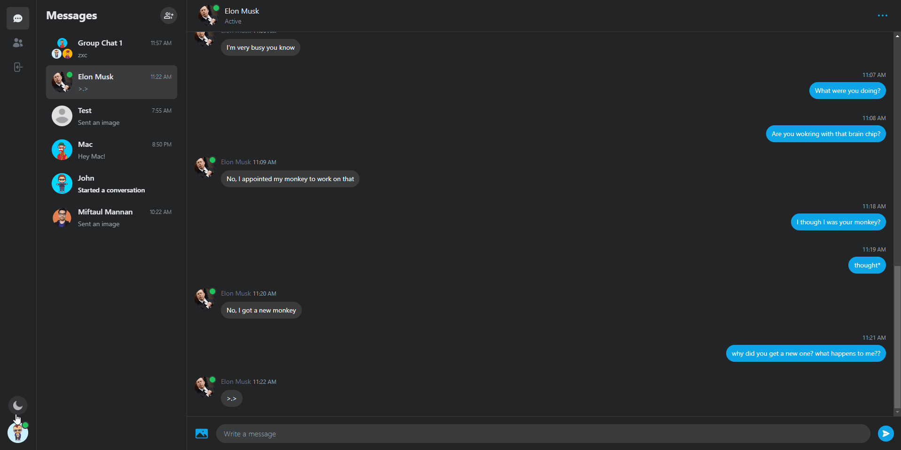</img>
</p>

- **[NextJs](https://nextjs.org/)** (13.4.x)
- **[React](https://facebook.github.io/react/)** (18.x)
- **[MongoDB](https://www.mongodb.com/atlas/database)** (6.x)
- **[Tailwind CSS](https://tailwindcss.com/)** (3.x)
- **[Pusher](https://pusher.com/)** (5.x)
- **[Next-Auth](https://next-auth.js.org/)** (4.x)
- **[Typescript](https://www.typescriptlang.org/)** (5.x)
- Production build script

## Live Demo

See a [live demo](https://nextjs-messenger-clone-tasin5541.vercel.app/) on Vercel

## Features

<p align="center"> 
    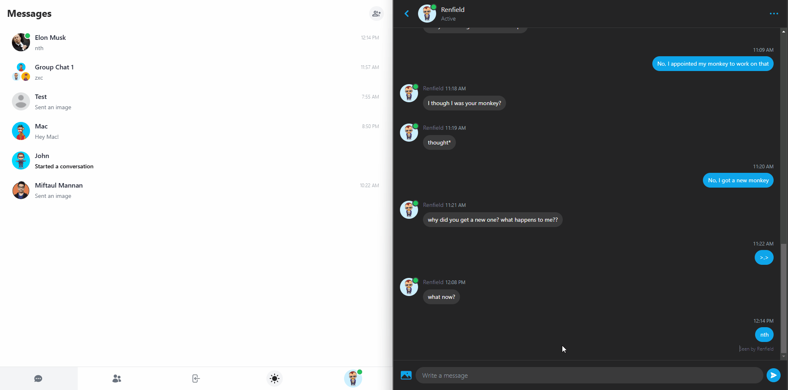</img>
</p>

- Real-time chat update with Pusher
- Group chat
- Delete chat history
- Image hosting with Cloudinary
- Dynamic Theme support (Light and Dark mode)
- Support for both Desktop and Mobile screens

## Installation

### Setup MongoDB

1. Navigate to https://www.mongodb.com/atlas/database and register

2. Find and Select `Build a Database` <br>
   Select the Free tier and press on `Create` at the bottom <br>
   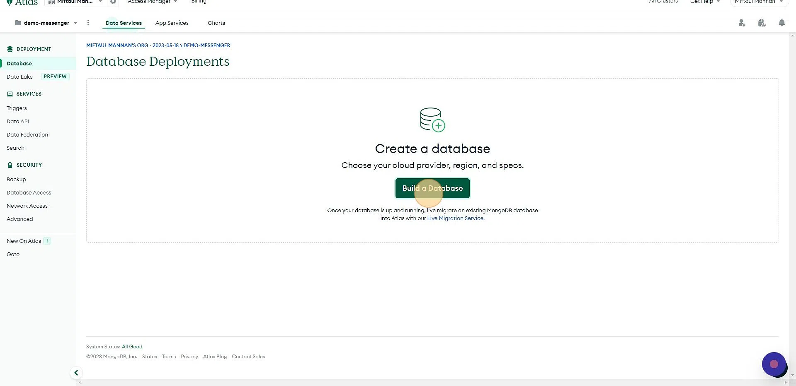

3. Create a user (note down the password) <br>
   Scroll down to `Add entries to your IP Access List` <br>
   Enter `0.0.0.0/0` and press `Add Entry` <br>
   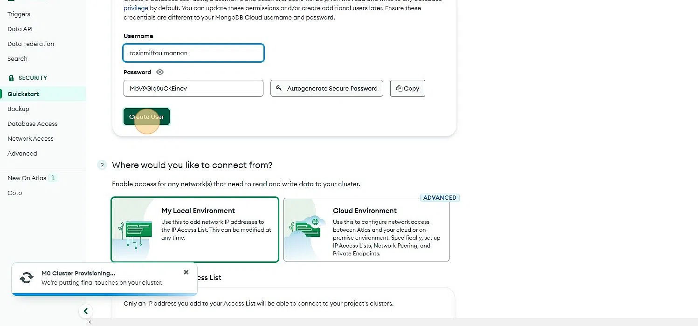

4. Press `Go to Databases` <br>
   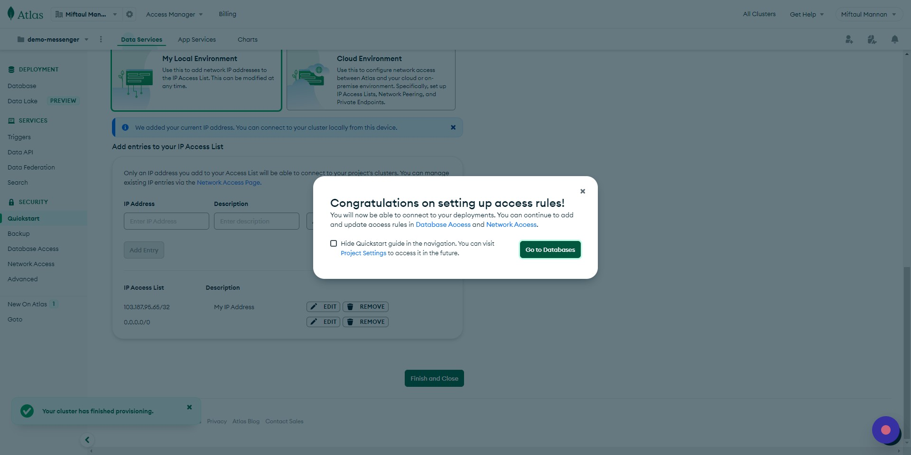

5. Click on `Connect` and select `MongoDB for VSCode` <br>
   Copy the connection string and save it in a notepad <br>
   Replace `<password>` with your password set on step 3 <br>
   Add `test` at the end of the connection string (ex. `connectionstring/test`) <br>
   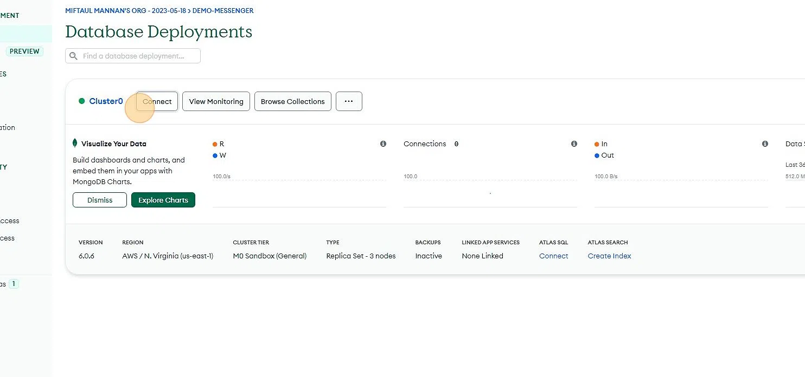

### Setup GitHub Authentication

1. Navigate to https://github.com/ <br>
   Click on your profile dropdown on the top right <br>
   Click `Settings` <br>
   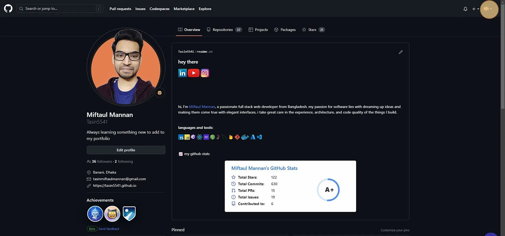

2. Click `Developer settings` <br>
   Click `OAuth Apps` <br>
   Click `New OAuth App` <br>
   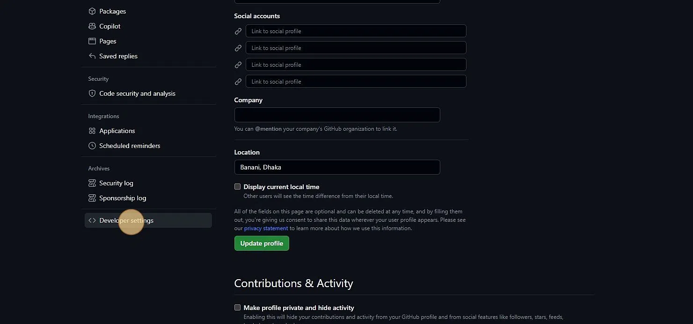

3. Give a name to your app <br>
   Type `http://localhost:3020/` in the `Homepage URL` and `Authorization callback URL` fields. <br>
   Click "Register application" <br>
   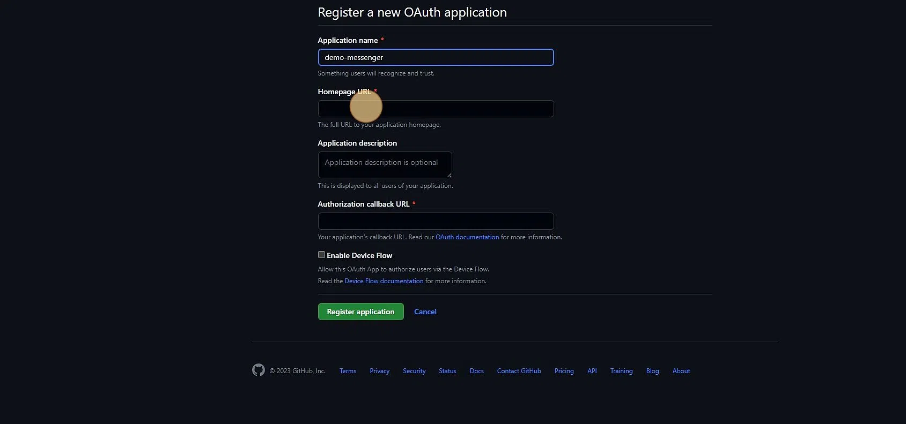

4. Copy the `Client Id` and note it down <br>
   Click on `Generate a new client secret`, copy and note it down <br>
   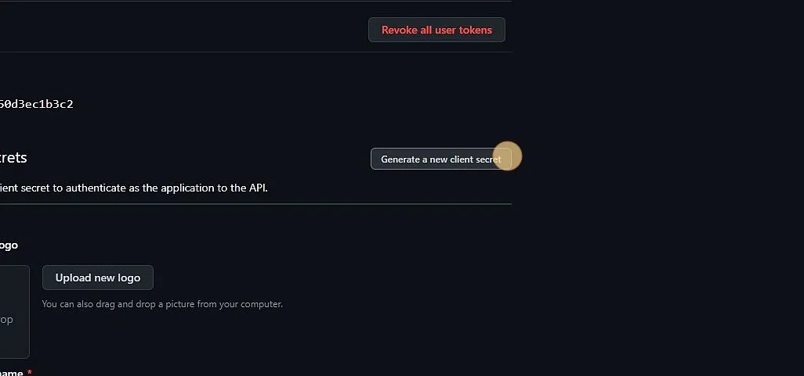

### Setup Google Authentication

1. Navigate to https://console.cloud.google.com and create a new project <br>
   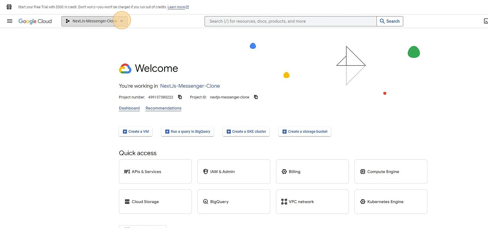

2. Navigate to the newly created project and search for `API & Services` <br>
   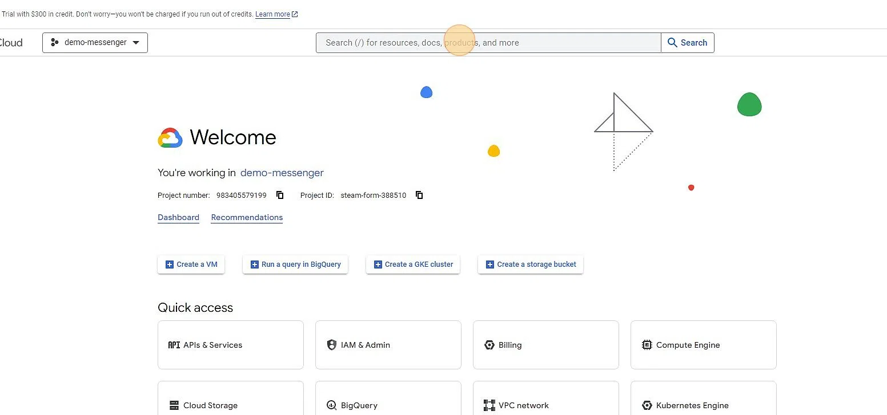

3. Go to `OAuth consent screen` <br>
   Click the `External` field <br>
   Click `CREATE` <br>
   

4. Click the `App name` field and give it a name <br>
   On User Mail field, select your email <br>
   Scroll down to `Developer contact information` and type your email <br>
   Click `SAVE AND CONTINUE` until you're on the `Summary` step <br>
   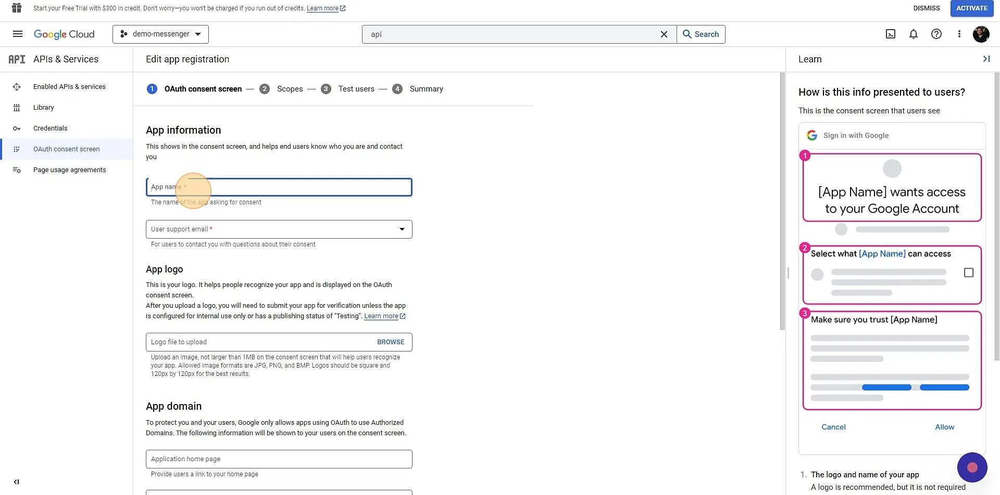

5. Go to `Credentials` <br>
   Click `CREATE CREDENTIALS` <br>
   Select `OAuth client ID` <br>
   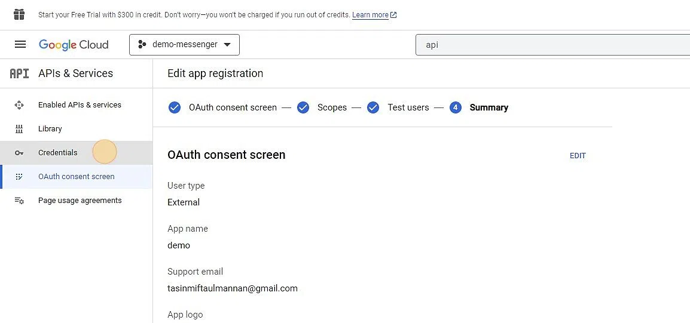

6. Select `Web application` as Application Type <br>
   Scroll down to `Authorized redirect URIs` and add `http://localhost:3020/api/auth/callback/google` <br>
   Click `CREATE` <br>
   Copy the `CLient ID` and `Client Secret` and note it down <br>
   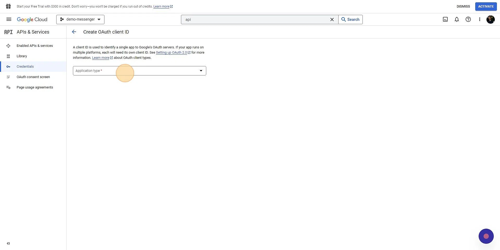

### Setup Cloudinary

1. Navigate to https://console.cloudinary.com and login <br>
   Go to `Dashboard` and note down the `Cloud name` <br>
   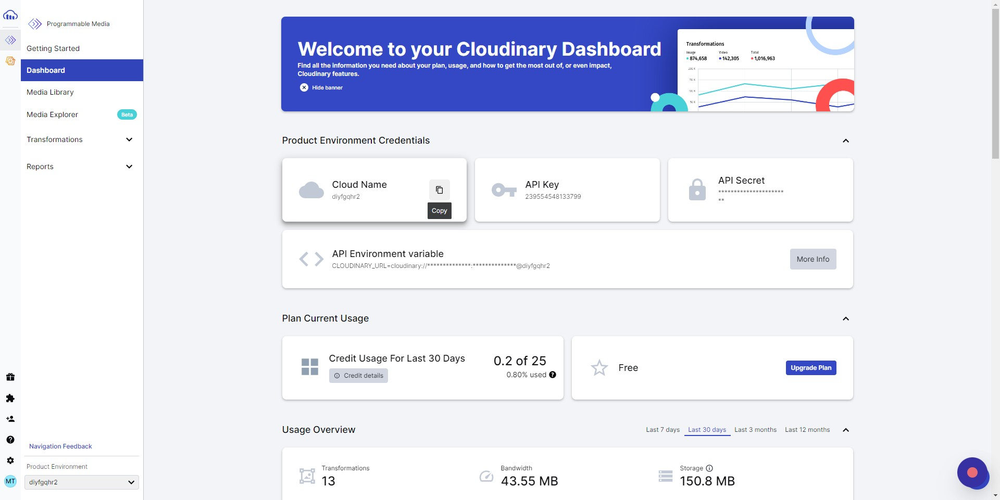

2. Go to settings <br>
   Then go to `Upload` <br>
   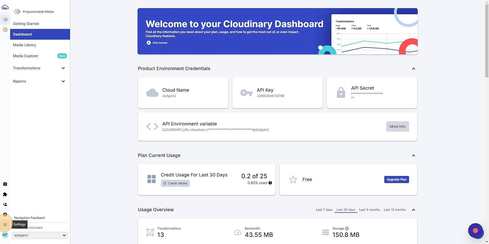

3. Click `Add upload preset` <br>
   Change `Signing Mode` to `Unsigned` <br>
   Click `Save`
   Copy the newly added preset name and note it down <br>
   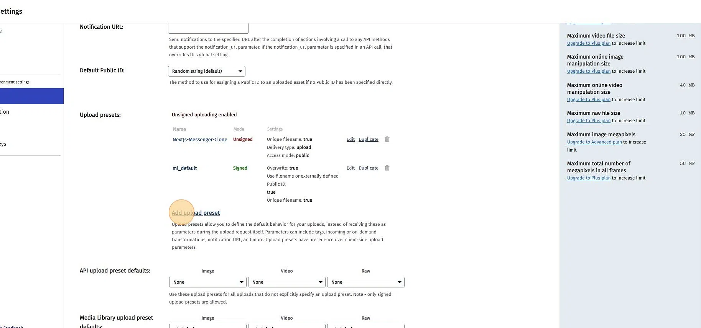

### Setup Pusher

1. Navigate to https://dashboard.pusher.com/channels <br>
   Click `Create app` (or `Get Started`) <br>
   Give the app a name <br>
   Select `React` for Frontend and `Node.js` for Backend <br>
   Create the app <br>
   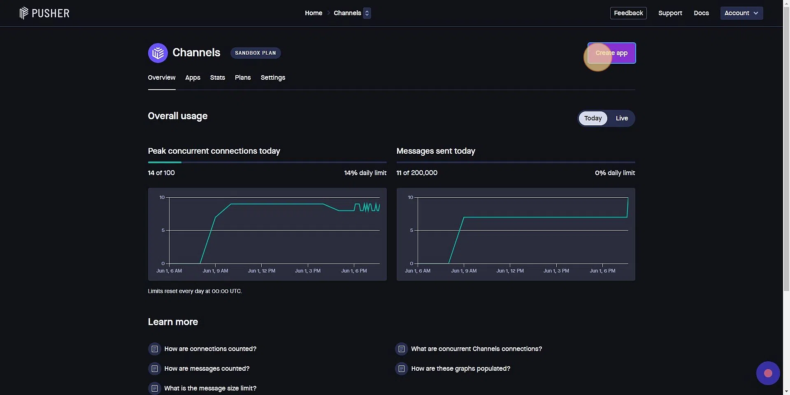

2. Go to `App Keys` <br>
   Note down values <br>
   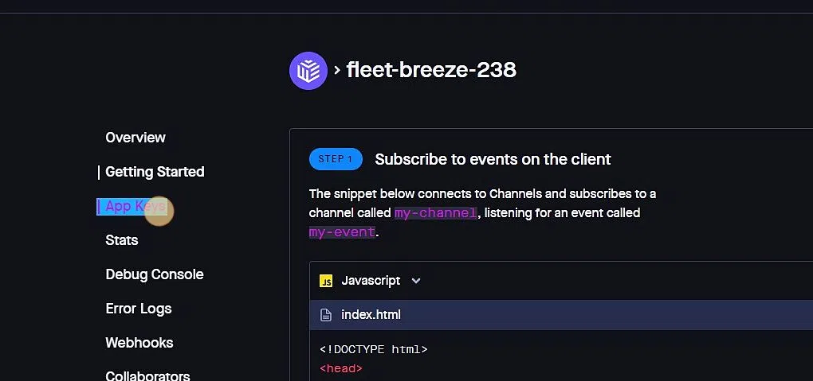

### Setup Project

1. Clone/download repo
2. Create a file called .env.local in the root directory of your project, type the following in cmd/powershell
   ```
   cp env.example .env.local
   ```
3. Inside the `.env.local` file, add the MongoDB, Pusher, Cloudinary, GitHub and Google keys from the previous steps
4. `yarn install` to install the dependencies (run `npm install yarn` if you don't have yarn installed)
5. `yarn prisma db push` to create the DB collections
6. `prisma generate` to create the prisma client

## Usage

**Development**

`yarn dev`

- Build app continuously (HMR enabled)

**Production**

`yarn build`
`yarn start`

- Build app once (HMR disabled) to `/.next/`

---

**All commands**

| Command      | Description                                |
| ------------ | ------------------------------------------ |
| `yarn dev`   | Build app continuously (HMR enabled)       |
| `yarn build` | Build app once (HMR disabled) to `/.next/` |
| `yarn start` | Run production build                       |

## See also

- Some Design ideas were taken from [Facebook Messenger](https://www.facebook.com/messenger/)
- Some Implementation Ideas for this project are taken from [Josh](https://www.youtube.com/@joshtriedcoding) and [Antonio](https://www.youtube.com/@codewithantonio)
- Project was bootstrapped with [create-next-app](https://nextjs.org/docs/api-reference/create-next-app)
